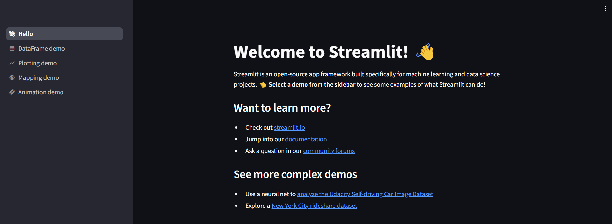

# LLMAppStreamlit - ZTM

## Notes on what we will be using & brief intro about them

- learn to use Streamlit to create a frontend for an LLM-powered Q&A application.
- **`Streamlit is an open-source Python library that simplifies the creation and sharing of custom frontends for machine learning and data science apps with the world.`**
- **LangChain is an OpenSource framework that allows developers working with Al to combine LLMs with external sources of computation and data.**
  - LLMs alone are often limited in their ability to understand the context, interact with the real world, or learn and adapt.
  - LLMs have an impressive general knowledge but are limited to their training data.
  - LangChain allows you to connect an LLM like GPT-4/Gemini to your own sources of data.
  - Using LangChain you can make your LLM Application take actions.
  - LangChain is data-aware and agentic-aware.
  - LangChain Main Concepts
    - LangChain Components
      - LLM Wrappers - allow us to connect to and use large language models like GPT -4.
      - Prompt Templates - allow us to create dynamic prompts which are the input to the LLMs.
      - Indexes - Indexes allow us to extract relevant information for the LLMs.
      - Memory - is the concept of storing and retrieving data in the process of a conversation.
        - Short-term memory generally refers to how to pass data in the context of a single conversation and - long-term memory deals with how to fetch and update information between conversations.
    - Chains - Chains allow us to combine multiple components together to solve a specific task and build an entire LLM application.
    - Agents - Agents facilitate interaction between the LLM and external APIs. They play a crucial role in decision-making, determining which actions the LLM should undertake.This process involves taking an action, observing the result, and then repeating the cycle until completion.
- **Example**: You take a document you want your language model to reference and slice it up into smaller chunks,store those chunks in a vector database as embeddings,which are numeric representations of text.These capabilities open up infinite no.of practical use cases.Now you can ask anything about the document(which may be 100 pages long) & the app will give the correct answer.Langchain implements abstraction like chains and agents so that a developer doesn't happen to know what happens under the hood.
  - Example use-cases: ChatBots, Questions Answering System, Summarization Tools.

### Deep Dive Notes on App step by step

```bash
pip install -U langchain-google-genai
pip install openai langchain pinecone-client tiktoken python-dotenv docx2txt pandas requests aiohttp PyYAML numpy # libraries in requirements.txt
pip show langchain # to check whether langchain is installed in .ipynb
pip install langchain_community # for SQLite Caching
pip freeze>requirements.txt # do this whenever you've installed any new libraries , so that it updates the requirements.txt file
```

- Let's explore Langchain a bit - `langchain_deep_dive.ipynb` & then we create the APP in jupyter notebook first & then we will integrate the functions with frontend.
- Setting up the environment: Langchain,Python-dotenv - add the required libraries in `requirements.txt` and install it in `.ipynb` file.
- we will use [google-gemini](https://python.langchain.com/api_reference/google_genai/) as LLM Model we want to make use of & not GoogleVertexAI - [why?-Read this docs from langchain-google-providers](https://python.langchain.com/docs/integrations/providers/google/#chat-models) & ChatGoogleGenerativeAI - [APIReference](https://python.langchain.com/api_reference/google_genai/chat_models/langchain_google_genai.chat_models.ChatGoogleGenerativeAI.html)
- Caching LLM Responses - [exampleReference](https://python.langchain.com/docs/how_to/llm_caching/)
- LLM Streaming, [Streaming](https://python.langchain.com/docs/concepts/streaming/) in Langchain
- [prompt templates](https://python.langchain.com/docs/concepts/prompt_templates/)
- Simple Chains & [Sequential Chains](https://python.langchain.com/docs/versions/migrating_chains/) - LangChain maintains a number of legacy abstractions. Many of these can be reimplemented via short combinations of LCEL and LangGraph primitives.

### commands & Resources

```bash
echo "# LLMAppStreamlit" >> README.md
python -m venv env # create an env to install the libraries we need
source env/Scripts/activate # activate the env
# to deactivate - deactivate - simple
pip install streamlit
pip freeze>requirements.txt # we want to store what all libraries we installed in our project into this file time to time - run this command to update the requirements.txt
pip install black # python formatter
pip install jupyter # to work with jupyter notebooks in our env.
```

**Resources :**

`Here are the resources you'll need for this Project:`

[Files for Section 1 (Streamlit Fundamentals)](https://drive.google.com/drive/folders/1BkdFVZ4pE4eAabkGz7SH0HK1cwDww8eJ)

[Files for Section 2 (Building a Frontend for the LLM-powered Q&A App using Streamlit)](https://drive.google.com/drive/folders/1Ein0oHa-eAyLNC-dat73G6OC6SnPX6lJ?usp=sharing)

#### [Streamlit](https://streamlit.io/#install) fundamentals

- let's explore a bit about streamlit before building the app.
- why we want to use streamlit? - [github-star-history](https://www.star-history.com/) - you can see how different libraries used for visualization have evolved over time.Streamlit has had an explosive [breakout](https://www.star-history.com/#streamlit/streamlit&Date) in the last few years.It's more geared towards machine learning and data science applications.

[](https://www.star-history.com/#streamlit/streamlit&Date)

- created a python env to install necessary dependencies we may need.
- Starting with `streamlit` & Validate the installation by running our Hello app:

```bash

(env)
abhis@Tinku MINGW64 ~/Desktop/AIAgents/LLMAppStreamlit (main)
$ streamlit hello

  Welcome to Streamlit. Check out our demo in your browser.

  Local URL: http://localhost:8501
  Network URL: http://192.168.29.185:8501

  Ready to create your own Python apps super quickly?
  Head over to https://docs.streamlit.io

  May you create awesome apps!

```

- we see following frontend on our browser @localURL: <http://localhost:8501>
  

- Displaying data on the screen , [streamlit-emoji-short-codes](https://streamlit-emoji-shortcodes-streamlit-app-gwckff.streamlit.app/) in **`st_write.py`** file

```bash
abhis@Tinku MINGW64 ~/Desktop/AIAgents/LLMAppStreamlit/st_fundamentals (main)
$ streamlit run st_write.py # to display the file on screen
```

- Streamlit Widgets - **`st_widgets.py`**

  - text_input, number_input, button
  - checkbox, radio, select
  - slider, file_uploader, camera_input, image

- streamlit layout

  - sidebar, columns, expander

- Streamlit progress bar - can be used to indicate code is running to the user.
- Streamlit session state - **st_session_state.py**

  - When you create a Streamlit app and open it in your browser, that is what we refer to as a session.
  - A session is a Python object that exists in memory for you to use between runs.
  - A **session state** is a way to share variables between runs.
  - How long does a session exist?
    - The session object exists as long as the user keeps a browser tab open and the connection between the front-end and the back-end is active.
    - Each time you open a new tab in the browser and go to your Streamlit app, a new session is created. These sessions are independent.
    - A session is what happens in the browser & `state is how we capture that and store the current value of widgets & parameters to use later in the same session`

- Streamlit Callbacks
  - A callback is a **function** that gets called when the **user interacts with a widget**.
  - We use callbacks via **on_change or on_click** parameters of the widget.
  - on_change and on_click parameters accept a function name as an input argument. This function is the callback.
  - If you use on_change or on_click, when Streamlit detects a change in a widget state, it will run the function specified in the on_change or on_click parameters and then will rerun the script as usual.
